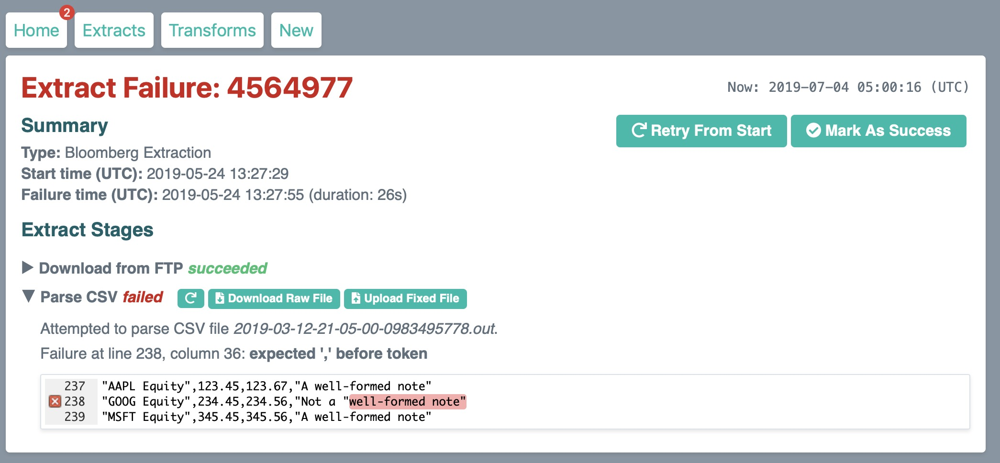

I'm experimenting with better tooling for [ETL](https://en.wikipedia.org/wiki/Extract,_transform,_load) systems. Can we make common data issues *quick* to resolve? Can automated data transformations be as easy to work with as spreadsheets? 

I think the answer to both questions is yes, but don't take my word for it – the latest build is available at [etlsheets.netlify.com](http://etlsheets.netlify.com). Try opening failed extracts+transforms by double-clicking in the "Recent issues" table.

## Motivation

Importing data at scale is painful. Your data providers *will* screw up the formatting, systems *will* experience connectivity issues, and your transformation logic *will* fail on cases you didn't expect. What if our tools focused on helping with those failures, instead of assuming the [happy path](https://en.wikipedia.org/wiki/Happy_path)?

Speaking of transformations, how should we write them? Some systems take a code-first approach, which is great for coders and impenetrable for everyone else. Others take a GUI-driven approach, which usually becomes [the stuff of nightmares](https://www.iri.com/blog/wp-content/uploads/2016/03/EDIT-IN-WP-From-Informatica-to-Voracity-via-ADS-CATfX-Paul-Kinnier-AnalytiX-DS-2.jpg). I think we can do better, by drawing inspiration from a tool that's found in every office:

## Transformations

[Here's what building a new transformation might look like](https://etlsheets.netlify.com/new/), and [here's what it might look like when that transformation fails to run successfully](https://etlsheets.netlify.com/transform/?id=4564980).

This works very much like a spreadsheet, albeit with visually distinct stages/steps. New columns can be created by entering a simple formula, and existing rows can be filtered+altered with simple row-level formulae. Significantly, formula changes are reflected immediately in the data – this might seem like a trivial feature, but I think it's a key part of usability. Bret Victor's made an entire career out of [his "creators need an immediate connection to what they're creating" principle](http://blog.ezyang.com/2012/02/transcript-of-inventing-on-principleb/), and for good reason.

Under the hood, formulae are written in JavaScript with some syntactic sugar (to make it easier to refer to columns) and macros (for common uses like filtering). I'm not tied to JS in particular, but using a "real" programming language gives us a lot more power and flexibility. Interoperating with existing libraries+code becomes trivial.

Try opening up [the failed extraction](https://etlsheets.netlify.com/transform/?id=4564980). Our counterparty has sent us an identifier with a typo (MSFY instead of MSFT), but we can just fix the data inline.

## Extractions

Extractions are a bit less interesting than transformations, but we can go a long way with some relatively simple interfaces. We know that connectivity and formatting issues are common, so when they happen let's show users exactly where the problem is:

